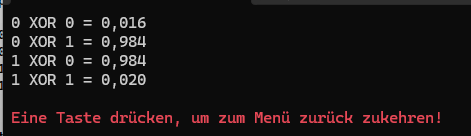
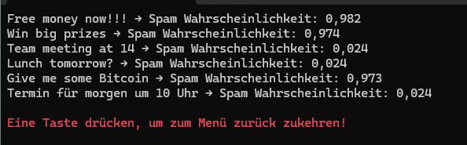

# Implementierung eines Neuronalen Netzes


]

## Basis Implementierung zu einem Neuronalen Netz
Das kleine Konsolenprogramm dient der Implementierung und Test eines einfachen Neuronalen Netzwerkes. Das Projekt dient der Migration alter Arbeiten auf Basis von LISP und Fortran zum Thema der Neuronalen Netzte. Nach und nach will ich versuchen auf der Grundidee eines Neurons das Beispiel zu erweitern.\
Das Feld für Neuronale Netzte ist sehr umfangreich, deshalb werde ich mich auf die Basis Implementierung eines Feedforward Netzes beschränken. Es gibt viele Möglichkeiten die Implementierung zu erweitern, z.B. durch die Einführung von Backpropagation, verschiedenen Aktivierungsfunktionen, Regularisierung oder der Verwendung von Convolutional oder Recurrent Neuronen.\
Daher sind alle Beispiele und Funktionen als Basis Implementierung zu verstehen, die nicht unbedingt für den produktiven Einsatz geeignet ist. Es soll vielmehr als Lernprojekt dienen, um die Funktionsweise von Neuronalen Netzten zu verstehen.

### Neuron
Ein künstliches Neuron berechnen:\


Mögliche Aktivierungsfunktion: **Sigmoid**\


Das Ergebnis ist nach **Sigmoid** ein Wert zwischen 0 und 1.
```text
0.02 → sehr unwahrscheinlich
0.50 → unklar
0.95 → sehr wahrscheinlich
```
Hinweis: da es sich nur um eine Beispielimplementierung handelt, ist das Netz nicht trainiert. Die verwendete Gewicht sind daher *Random*. Deshalb sind die Ergebnisse zufällig.

## Beispielsource zur Erstellung eines Neuron

```csharp
NeuralNetwork net = new NeuralNetwork(inputSize: 2, layerSizes: new int[] { 3, 1 } );
double[] input = { 0.5, 0.8 };
double[] result = net.Predict(input);
```
## Beispielsource zur Lösung des XOR Problems

```csharp
NeuralNetwork net = new NeuralNetwork();

double[][] inputs =
{
    new double[]{0,0},
    new double[]{0,1},
    new double[]{1,0},
    new double[]{1,1}
};

double[][] outputs =
{
    new double[]{0},
    new double[]{1},
    new double[]{1},
    new double[]{0}
};

for (int epoch = 0; epoch < 10000; epoch++)
{
    for (int i = 0; i < inputs.Length; i++)
    {
        net.Train(inputs[i], outputs[i]);
    }
}

foreach (var input in inputs)
{
    var result = net.Predict(input);

    Console.WriteLine($"{input[0]} XOR {input[1]} = {result[0]:F3}");
}
```



## Erstellen eines einfachen Spamfilter mit Training Funktion

```csharp
/* Beispielhafte E-Mails mit Label (1 = Spam, 0 = Kein Spam) */
var emails = new[]
{
    ("Win money now!!! http://spam.com", 1),
    ("Free money waiting for you", 1),
    ("Congratulations you win", 1),
    ("Meeting tomorrow at 10", 0),
    ("Please review the document", 0),
    ("Lunch today?", 0),
    ("Deine Festplatte ist verschlüsselt. Diese geben wir für 1000 Bitcoins wieder frei.",1)
};

NeuralNetwork net = new NeuralNetwork(emails.Length-1, new int[] { emails.Length-1, 1 });

/* Training des Spamfilter */
for (int epoch = 0; epoch < 5000; epoch++)
{
    foreach (var mail in emails)
    {
        double[] input = SpamFeatureExtractor.Extract(mail.Item1);
        double[] expected = { mail.Item2 };

        net.Train(input, expected);
    }
}

/* Test von tatsächlichen Inhalten */
Test(net);
```

Test für tatsächliche Inhalte eines Textes oder Mails
```csharp
private static void Test(NeuralNetwork net)
{
    string[] tests =
    {
        "Free money now!!!",
        "Win big prizes",
        "Team meeting at 14",
        "Lunch tomorrow?",
        "Give me some Bitcoin",
        "Termin für morgen um 10 Uhr",
    };

    foreach (var mail in tests)
    {
        var input = SpamFeatureExtractor.Extract(mail);
        var result = net.Predict(input);

        Console.WriteLine($"{mail} → Spam Wahrscheinlichkeit: {result[0]:F3}");
    }
}
```



Das Ergebnis ist nach **Sigmoid** ein Wert zwischen 0 und 1. Daher gilt für das Ergebnis des Spamfilter ob ein Inhalt Spam ist folgendes:
```text
0.02 → sehr unwahrscheinlich
0.50 → unklar
0.95 → sehr wahrscheinlich
```
