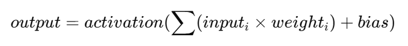
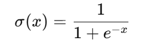

# Implementierung eines Neuronalen Netzes


]

## Basis Implementierung zu einem Neuronalen Netz
Das kleine Konsolenprogramm dient der Implementierung und Test eines einfachen Neuronalen Netzwerkes. Das Projekt dient der Migration alter Arbeiten auf Basis von LISP und Fortran zum Thema der Neuronalen Netzte. Nach und nach will ich versuchen auf der Grundidee eines Neurons das Beispiel zu erweitern.

### Neuron
Ein künstliches Neuron berechnen:\


Mögliche Aktivierungsfunktion: **Sigmoid**\


Das Ergebnis ist nach **Sigmoid** ein Wert zwischen 0 und 1.
```text
0.02 → sehr unwahrscheinlich
0.50 → unklar
0.95 → sehr wahrscheinlich
```
Hinweis: da es sich nur um eine Beispielimplementierung handelt, ist das Netz nicht trainiert. Die verwendete Gewicht sind daher *Random*. Deshalb sind die Ergebnisse zufällig.

## Beispielsource

```csharp
NeuralNetwork net = new NeuralNetwork(inputSize: 2, layerSizes: new int[] { 3, 1 } );
double[] input = { 0.5, 0.8 };
double[] result = net.Predict(input);
```

```xml
```

```json
```